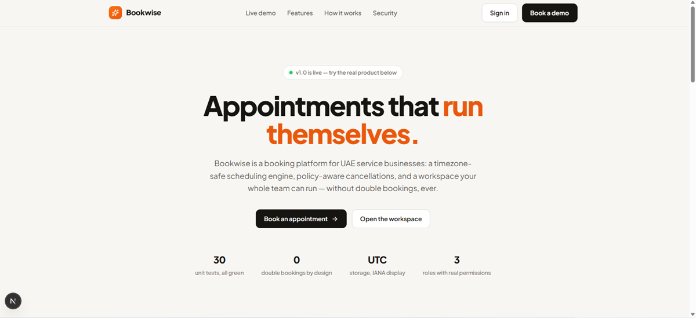
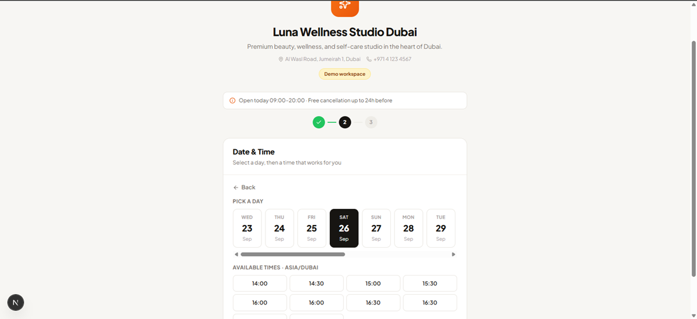
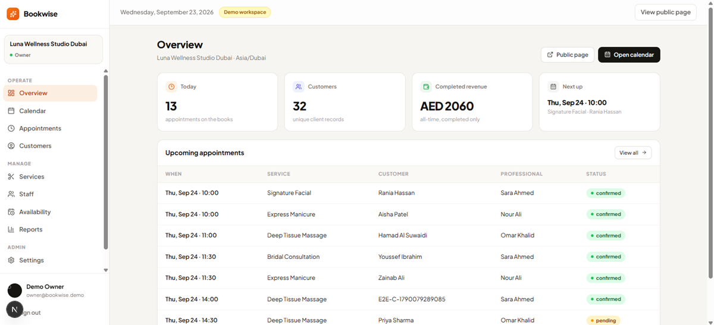
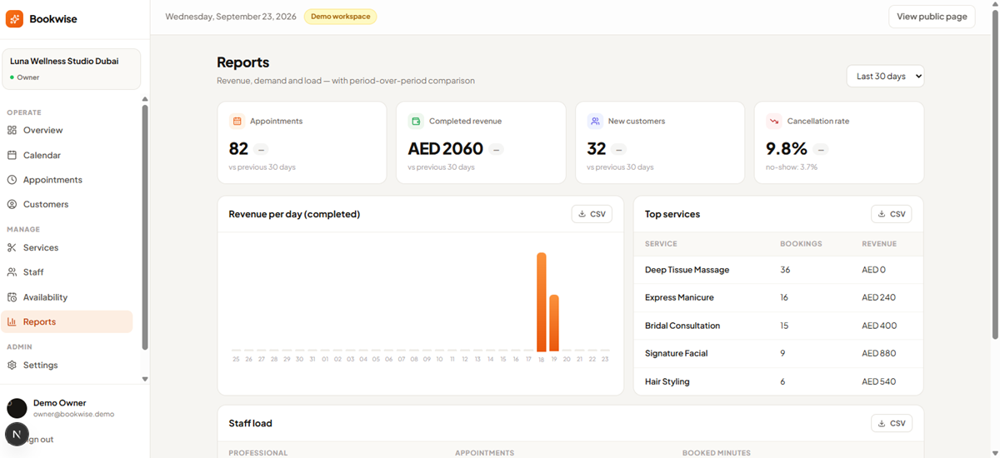
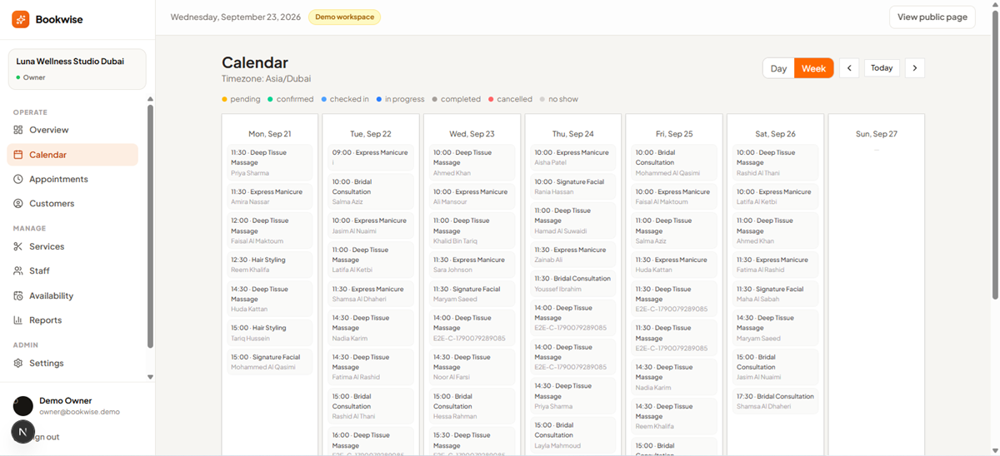
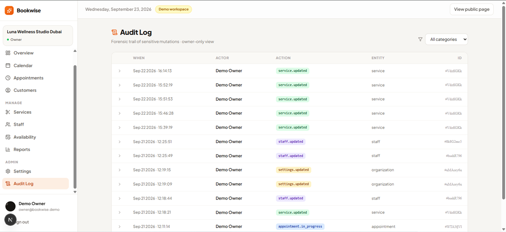

<div align="center">

# 📅 Bookwise

**Appointments that run themselves.**
<br />
*ساخت داشبورد مدیریت و گزارش‌گیری برای صاحبان کسب‌وکار*

A production-ready booking platform for UAE service businesses —
timezone-safe scheduling, policy-aware cancellations, role-based workspaces
and a forensic audit trail.

[](https://github.com/Mehrdaaad021/bookwise/actions/workflows/ci.yml)
[](https://github.com/Mehrdaaad021/bookwise/actions/workflows/e2e.yml)
[](https://bookwise-steel.vercel.app)
[](https://github.com/Mehrdaaad021/bookwise/actions)
[](LICENSE)

**[🌐 Live Demo](https://bookwise-steel.vercel.app)** · **[📅 Book a demo appointment](https://bookwise-steel.vercel.app/book/demo-salon)**

</div>

---

## 📸 Screenshots

| Landing | Public booking wizard |
|:---:|:---:|
|  |  |

| Owner dashboard | Reports with period comparison |
|:---:|:---:|
|  |  |

| Week calendar | Owner-only audit trail |
|:---:|:---:|
|  |  |

---

## ✨ Features

### For customers (public)
- **4-step booking wizard** — service → professional → date & time → details
- **Real availability engine** — computed from business hours, staff shifts, breaks, holidays, time-off and buffers. Never a static list
- **Self-service management** — private token link to reschedule or cancel, enforced by the business's policy windows

### For business owners (workspace)
- **Management dashboard** — 8 pages: Overview KPIs, week calendar, appointment lifecycle, customer profiles with lifetime value, services, staff, availability and settings
- **Reporting** — revenue per day, top services, staff load, cancellation & no-show rates, **period-over-period comparison** (▲/▼ vs previous period) and **CSV export** for Excel
- **Policy control** — cancellation/reschedule windows, minimum notice, booking horizon, emergency temporary closure
- **Forensic audit trail** (owner-only) — every sensitive mutation recorded with actor, timestamp and JSON payload

### Scheduling engine guarantees
- ⏰ **Timezone-safe** — timestamps stored in UTC, boundaries computed in the business's IANA timezone. DST changes cannot corrupt the calendar
- 🔒 **No double bookings** — every booking re-validates interval overlap inside a database transaction
- 📏 **Policy-aware lifecycle** — `pending → confirmed → checked_in → in_progress → completed`, plus `cancelled` / `no_show`, all gated by notice windows

---

## 🛡️ Security model

| Layer | Mechanism |
|---|---|
| Authentication | **Invite-only** — strangers can never obtain a session (no auto-provisioning) |
| Authorization | Server-side membership gate on the whole workspace + **role guards** (`owner` / `manager` / `staff`) on every admin procedure |
| Data isolation | Every query is scoped by `organizationId` verified against the session's membership |
| Audit | Owner-only forensic trail for sensitive mutations |
| Abuse | Rate limiting on public booking mutations, security headers, CSRF protection via Auth.js |
| Honesty | Known limitations are documented in [`docs/SECURITY.md`](docs/SECURITY.md) |

---

## 🧪 Testing strategy — 41 tests, all green

| Suite | Count | Covers |
|---|---|---|
| **Unit (Vitest)** | 30 | Scheduling engine (overlap, buffers, DST boundaries), money formatting, validation schemas |
| **E2E (Playwright)** | 11 | Full booking lifecycle, manage/cancel flow, invite-only rejection, role-based navigation, audit trail |

- CI runs typecheck + unit + lint on every push; E2E runs with a real browser
- Failures capture **screenshot + trace** as artifacts
- E2E fixtures handle real-world flakiness: CSRF cookie retry loop, loading-state-aware slot detection

---

## 🏗️ Tech stack

| Layer | Choice | Why |
|---|---|---|
| Framework | **Next.js 15** (App Router) | Server Components for data, Client Components for interactivity |
| Language | **TypeScript** (strict) | End-to-end type safety |
| API | **tRPC + React Query** | Type-safe procedures, no codegen, cache invalidation |
| Database | **Neon PostgreSQL + Drizzle ORM** | Serverless Postgres, SQL-first schema |
| Auth | **NextAuth v5 (Auth.js)** | Credentials provider with invite-only enforcement |
| Styling | **Tailwind CSS + design tokens** | Unified warm-neutral design system |
| Tests | **Vitest + Playwright** | Unit + real-browser E2E |
| CI/CD | **GitHub Actions + Vercel** | Automated quality gates and deploys |

---

## 🚀 Getting started

```bash
git clone https://github.com/Mehrdaaad021/bookwise.git
cd bookwise
npm install
cp .env.example .env.local   # fill DATABASE_URL + AUTH_SECRET
npm run db:push              # create schema
npm run db:seed              # demo workspace + staff + services
npm run dev
```

### Demo credentials (seeded)

| Role | Email |
|---|---|
| Owner | `owner@bookwise.demo` |
| Manager | `manager@bookwise.demo` |
| Staff | `staff@bookwise.demo` |

*(Sign-in is passwordless magic-link style for the demo: email alone identifies the invited member.)*

### Scripts

| Command | Purpose |
|---|---|
| `npm run dev` | Local dev server |
| `npm test` | Unit tests (Vitest, `src/` only) |
| `npm run test:e2e` | E2E suite (Playwright, real browser) |
| `npm run lint` / `npx tsc --noEmit` | Quality gates |

---

## 🗺️ Roadmap

- [ ] Real email delivery (Resend) and payments (Stripe)
- [ ] Recurring appointments and package deals
- [ ] SMS reminders via WhatsApp Business API
- [ ] Multi-branch support

---

## 📄 License

MIT — free to use for portfolio and learning purposes.

---

<div align="center">
Built with ❤️ as a portfolio project · <b>Bookwise v1.0.0</b>
</div>